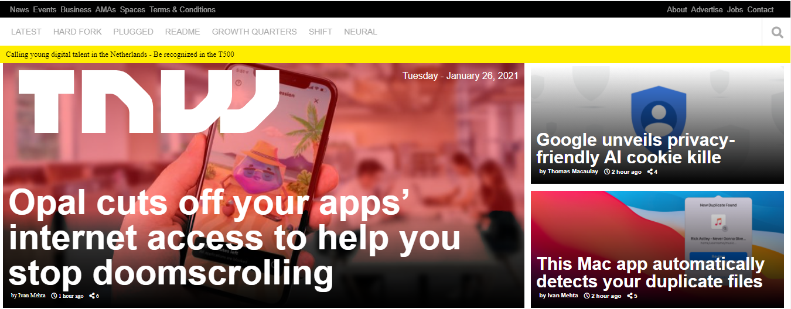
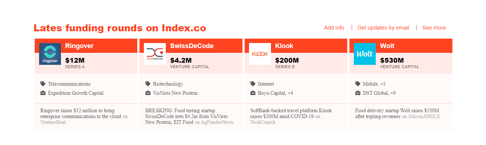
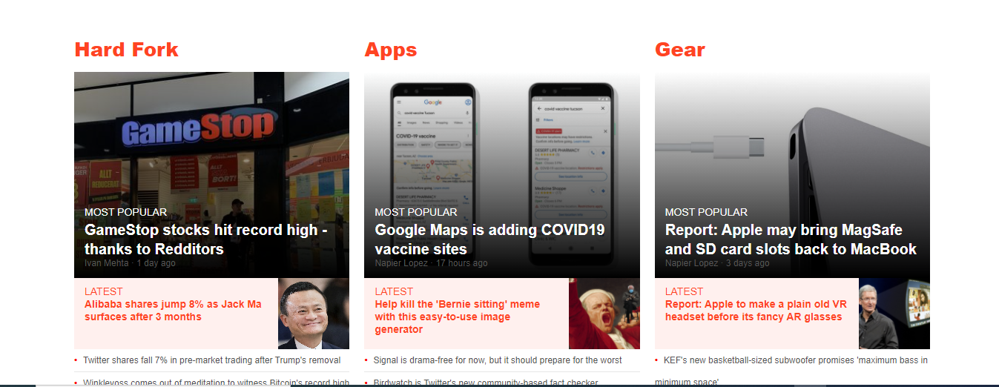

# The NextWeb Responsive Design
- A project that is based on working Responsive Website Design.

# Built With

- Linters
- HTML and CSS
- Flexbox
- Grid

# Live Demo
 [Live Demo Link](https://emmyn5600.github.io/TNW-clone-page-cont/)

# Getting started 

To get a local copy up and running follow these simple example steps.

- On the project GitHub page, navigate to the main page of the repository.

- Under the repository name, locate and click on a green button named Code.

- Copy the project URL as displayed.

- If you're running Windows Operating System, open your command prompt. On Linux, Open your terminal.

- Change the current working directory to the location where you want the cloned directory to be made. Leave as it is if the current location is where you want the project to be.

- Type git clone, and then paste the URL you copied in Step 3.
$ git clone 

- Press Enter key

- Press Enter. Your local copy will be created.

Please Note that you must have git installed on your PC, this can be done here.

# Install

- Git bash
- Vscode

# Authors

👤 NSABIMANA Emmanuel
- GitHub: [@emmyn5600](https://github.com/Emmyn5600)
- Twitter: [@NSABIMA62253884](https://twitter.com/NSABIMA62253884)
- LinkedIn: [@nsabimana-emmanuel-4276091b2](https://www.linkedin.com/in/nsabimana-emmanuel-4276091b2/)

👤 John Arboleda 

- GitHub: [@John-Arboleda](https://github.com/John-Arboleda)

- LinkedIn: [@john-jairo-arboleda-castillo](https://www.linkedin.com/in/john-jairo-arboleda-castillo/)

# 🤝 Contributing

Contributions, issues, and feature requests are welcome! Feel free to check the [issues page]().

# Show your support 

Give a ⭐️ if you like this project!

# Acknowledgments

- [Microverse](Microverse.org)
- [Perma | TNW](https://perma.cc/M5ZV-Q2D6)
- [OdinProject](https://www.theodinproject.com/)

# 📝 License 

This project is [MIT](https://github.com/microverseinc/readme-template/blob/master/lic.url) licensed.
